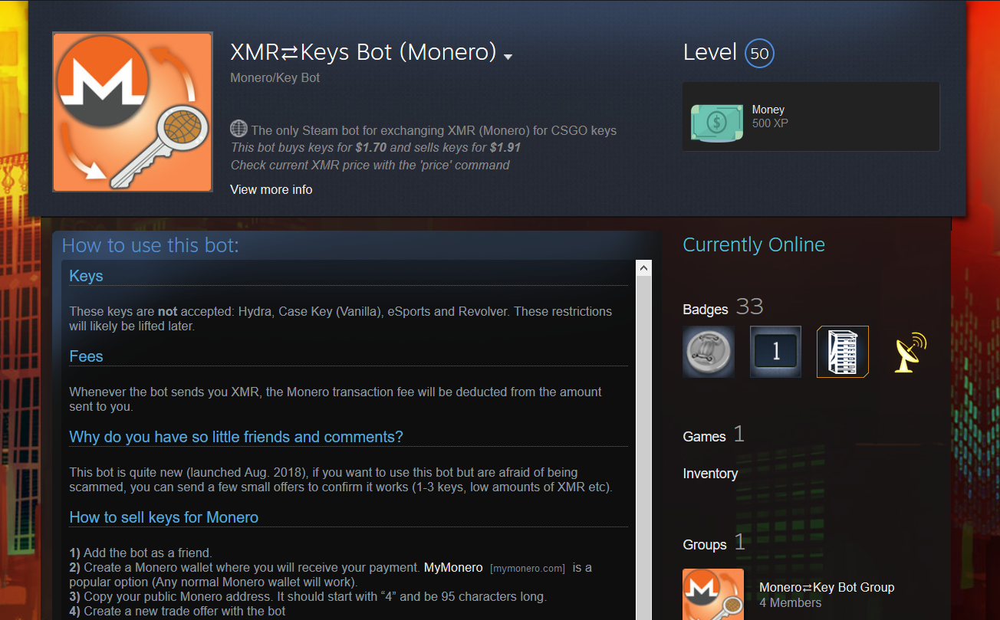

# Monero Key Bot

Code for a bot I made in 2018 to trade the cryptocurrency 'Monero (XMR)' for items from the game 'Counter-Strike'. Users could message the bot on Steam and be able to order items/Monero.

The bot ran on NodeJS, but also needed a local Monero node running for it's RPC. Most of the bot's code is located in `cryptobot.js`. Although the code isn't terrible, if I were to redo the project I would definitely split up this file (1.3k lines!). Granted a lot of that is due to having to write messages to users and error-checking.

Here is the [bot's steam account](https://steamcommunity.com/id/xmrkeybot). Unforutnately I've stopped working on it and running it due to changes made to the Steam trading system which made it hard for bots like mine to operate.